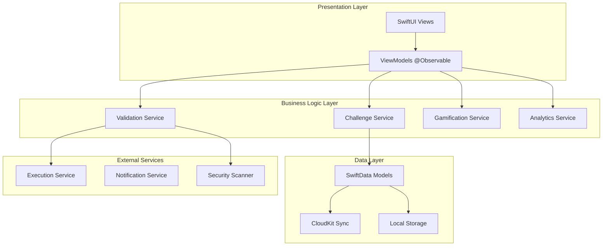

# Architecture Overview

## System Architecture Diagram



## Key Architectural Decisions

### 1. SwiftUI + MVVM with @Observable
**Decision**: Use SwiftUI with MVVM pattern leveraging iOS 17's @Observable macro

**Rationale**: 
- Modern reactive architecture with minimal boilerplate
- Better performance than ObservableObject/Combine
- Type-safe state management
- Seamless integration with SwiftUI lifecycle

```swift
@Observable
class ChallengeViewModel {
    private(set) var challenges: [Challenge] = []
    private(set) var isLoading = false
    private(set) var errorMessage: String?
    
    private let repository: ChallengeRepository
    
    init(repository: ChallengeRepository) {
        self.repository = repository
    }
    
    func loadChallenges() async {
        isLoading = true
        errorMessage = nil
        
        do {
            challenges = try await repository.fetchChallenges()
        } catch {
            errorMessage = error.localizedDescription
        }
        
        isLoading = false
    }
}
```

### 2. SwiftData with CloudKit Sync
**Decision**: SwiftData as primary ORM with CloudKit integration

**Rationale**:
- Native Apple framework with automatic CloudKit sync
- Type-safe Core Data wrapper with modern Swift syntax
- Automatic relationship management
- Built-in migration support

```swift
@Model
class Challenge {
    @Attribute(.unique) var id: String
    var title: String
    var description: String
    var difficulty: DifficultyLevel
    var category: String
    var tags: [String]
    var timeLimit: Int
    var createdDate: Date
    
    @Relationship(deleteRule: .cascade) var testCases: [TestCase]
    @Relationship(inverse: \ChallengeAttempt.challenge) var attempts: [ChallengeAttempt]
    
    init(id: String, title: String, description: String) {
        self.id = id
        self.title = title
        self.description = description
        self.difficulty = .whiteBelt
        self.category = ""
        self.tags = []
        self.timeLimit = 300
        self.createdDate = Date()
    }
}
```

### 3. Hybrid Validation Architecture
**Decision**: Client-side pre-validation + server-side execution

**Rationale**:
- Immediate feedback for syntax errors
- Secure code execution in isolated containers
- Optimistic UI updates for better UX
- Reduced server load through client-side filtering

## Design Patterns Used

| Pattern | Implementation | Purpose |
|---------|---------------|---------|
| MVVM | @Observable ViewModels | Separation of concerns, testability |
| Repository | Data abstraction layer | Consistent data access, offline support |
| Strategy | Algorithm execution | Support multiple programming languages |
| Observer | Progress tracking | Real-time UI updates |
| Factory | Challenge generation | Dynamic problem creation |
| Command | User actions | Undo/redo functionality |

## Navigation Architecture

**NavigationStack for iPhone and NavigationSplitView for iPad:**

```swift
struct MainNavigationView: View {
    @State private var selectedDifficulty: DifficultyLevel?
    @State private var selectedChallenge: Challenge?
    
    var body: some View {
        NavigationSplitView {
            DifficultyLevelSidebar(selection: $selectedDifficulty)
        } content: {
            if let difficulty = selectedDifficulty {
                ChallengeListView(difficulty: difficulty, selection: $selectedChallenge)
            }
        } detail: {
            if let challenge = selectedChallenge {
                CodingChallengeView(challenge: challenge)
            } else {
                ContentUnavailableView("Select a challenge")
            }
        }
    }
}
```

## Project Structure

```
CodeKata.xcodeproj/
├── CodeKata/
│   ├── App/
│   │   ├── CodeKataApp.swift          # App entry point
│   │   └── ContentView.swift          # Root view
│   ├── Features/
│   │   ├── Authentication/
│   │   ├── Challenges/
│   │   ├── CodeEditor/
│   │   ├── Gamification/
│   │   └── Progress/
│   ├── Shared/
│   │   ├── Models/
│   │   ├── Services/
│   │   ├── Extensions/
│   │   └── Utilities/
│   └── Resources/
│       ├── Assets.xcassets
│       ├── Colors.xcassets
│       └── Localizable.strings
├── CodeKataTests/
├── CodeKataUITests/
└── Packages/
    └── LocalPackages/
```

## Data Flow Architecture

### Repository Pattern Implementation

```swift
protocol ChallengeRepositoryProtocol {
    func fetchChallenges(difficulty: DifficultyLevel) async throws -> [Challenge]
    func fetchChallenge(id: String) async throws -> Challenge?
    func saveChallenge(_ challenge: Challenge) async throws
    func deleteChallenge(id: String) async throws
}

@Observable
class ChallengeRepository: ChallengeRepositoryProtocol {
    private let modelContext: ModelContext
    private let networkService: NetworkService
    private let cacheManager: CacheManager
    
    init(modelContext: ModelContext, networkService: NetworkService) {
        self.modelContext = modelContext
        self.networkService = networkService
        self.cacheManager = CacheManager()
    }
    
    func fetchChallenges(difficulty: DifficultyLevel) async throws -> [Challenge] {
        // Try cache first
        if let cached = cacheManager.getCachedChallenges(difficulty: difficulty) {
            return cached
        }
        
        // Fetch from local database
        let descriptor = FetchDescriptor<Challenge>(
            predicate: #Predicate { $0.difficulty == difficulty },
            sortBy: [SortDescriptor(\.createdDate, order: .reverse)]
        )
        
        let localChallenges = try modelContext.fetch(descriptor)
        
        // Background sync with server
        Task {
            await syncChallengesWithServer(difficulty: difficulty)
        }
        
        return localChallenges
    }
}
```

## Dependency Injection

```swift
// Environment-based dependency injection
private struct ChallengeServiceKey: EnvironmentKey {
    static let defaultValue: ChallengeService = DefaultChallengeService()
}

extension EnvironmentValues {
    var challengeService: ChallengeService {
        get { self[ChallengeServiceKey.self] }
        set { self[ChallengeServiceKey.self] = newValue }
    }
}

// Usage in views
struct ChallengeView: View {
    @Environment(\.challengeService) private var challengeService
    // View implementation
}

// App setup
@main
struct CodeKataApp: App {
    var body: some Scene {
        WindowGroup {
            ContentView()
                .environment(\.challengeService, ProductionChallengeService())
        }
    }
}
```

## Performance Considerations

### Memory Management
- Use `@Observable` instead of `ObservableObject` for better performance
- Implement proper weak references to avoid retain cycles
- Use lazy loading for heavy resources
- Implement efficient caching strategies

### UI Performance
- Use `LazyVStack`/`LazyHStack` for large collections
- Implement view recycling for complex lists
- Optimize image loading and caching
- Use background queues for heavy computations

## Security Architecture

### Code Execution Security
- Server-side code execution in isolated containers
- Client-side syntax validation
- Input sanitization and validation
- Rate limiting on API endpoints

### Data Security
- Keychain storage for sensitive data
- Certificate pinning for network requests
- Encrypted local storage for user data
- CloudKit private database for user sync

## Related Pages
- [[Data-Models]] - Detailed data model specifications
- [[State-Management]] - SwiftUI state management patterns
- [[Security-Sandboxing]] - Security implementation details
- [[Performance]] - Performance optimization strategies