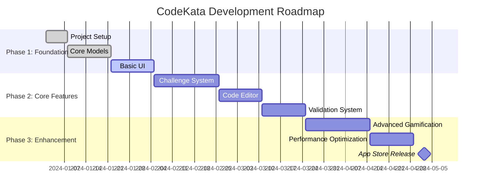

# CodeKata: Daily Coding Challenges for iOS
*Transform your coding skills one challenge at a time*

## 🚀 Quick Start Links
- [📱 Project Setup & Installation](Project-Setup)
- [🏗️ Architecture Overview](Architecture-Overview)
- [💻 Development Environment](Development-Environment)
- [🎯 Getting Started Tutorial](Getting-Started-Tutorial)

## 📋 Project Overview

CodeKata transforms algorithm practice into an engaging mobile experience, making coding skill development as addictive as mobile gaming while building genuine programming competency.

### Core Objectives
- **Daily Practice**: Bite-sized challenges designed for consistent daily learning
- **Skill Progression**: Three-tier difficulty system (White/Brown/Black Belt)
- **Mobile-First**: Optimized for iPhone with excellent iPad support
- **Gamification**: Achievement system, streaks, and competitive elements
- **Quality Focus**: Clean architecture, comprehensive testing, robust CI/CD

### Key Metrics & Goals
| Metric | Phase 1 Target | Phase 2 Target | Phase 3 Target |
|--------|---------------|---------------|---------------|
| Daily Active Users | 100+ | 1,000+ | 10,000+ |
| Challenge Completion Rate | 70% | 75% | 80% |
| User Retention (7-day) | 40% | 50% | 60% |
| Test Coverage | 80% | 85% | 90% |
| App Store Rating | 4.0+ | 4.5+ | 4.7+ |

## 📚 Wiki Navigation

### **Core Documentation**
- **[🏠 Home](Home)** - Project overview and quick navigation
- **[📋 Project Overview](Project-Overview)** - Vision, goals, and roadmap
- **[🏗️ Architecture Overview](Architecture-Overview)** - System design and patterns
- **[📱 Tech Stack Guide](Tech-Stack-Guide)** - Technologies and frameworks used

### **Development Setup**
- **[💻 Development Environment](Development-Environment)** - Xcode, tools, and configuration
- **[📦 Project Setup](Project-Setup)** - Clone, build, and run instructions
- **[🔧 Configuration Guide](Configuration-Guide)** - Environment variables and settings
- **[🛠️ Build & Deploy](Build-Deploy)** - CI/CD pipeline and deployment process

### **Architecture & Design**
- **[🏛️ System Architecture](System-Architecture)** - Detailed architectural diagrams
- **[📊 Data Models](Data-Models)** - SwiftData models and relationships
- **[🎨 UI/UX Design System](UI-UX-Design-System)** - SwiftUI components and patterns
- **[🔄 State Management](State-Management)** - MVVM and @Observable patterns

### **Feature Documentation**
- **[🧩 Challenge System](Challenge-System)** - Problem generation and management
- **[⚡ Code Editor](Code-Editor)** - Mobile-optimized editing interface
- **[✅ Solution Validation](Solution-Validation)** - Testing and scoring system
- **[🏆 Gamification Engine](Gamification-Engine)** - Achievements, scoring, and progression
- **[📊 Progress Tracking](Progress-Tracking)** - Analytics and user insights

### **API & Integration**
- **[🔌 API Documentation](API-Documentation)** - Backend endpoints and models
- **[☁️ CloudKit Integration](CloudKit-Integration)** - Data sync and user management
- **[🔒 Security & Sandboxing](Security-Sandboxing)** - Code execution security
- **[📡 Networking](Networking)** - HTTP client and error handling

### **Testing & Quality**
- **[🧪 Testing Strategy](Testing-Strategy)** - Unit, integration, and UI testing
- **[📏 Code Quality](Code-Quality)** - Linting, formatting, and best practices
- **[🔍 Debugging Guide](Debugging-Guide)** - Common issues and solutions
- **[📈 Performance](Performance)** - Optimization and profiling

### **Contribution & Maintenance**
- **[🤝 Contributing Guidelines](Contributing-Guidelines)** - How to contribute to the project
- **[📝 Coding Standards](Coding-Standards)** - Swift style guide and conventions
- **[🔄 Git Workflow](Git-Workflow)** - Branching strategy and pull requests
- **[📅 Release Process](Release-Process)** - Version management and changelog

### **Learning Resources**
- **[🎓 Swift for Java/C++ Developers](Swift-For-Java-CPP-Developers)** - Language transition guide
- **[📚 SwiftUI Learning Path](SwiftUI-Learning-Path)** - Progressive learning resources
- **[🛠️ iOS Development Best Practices](iOS-Development-Best-Practices)** - Platform-specific guidelines
- **[🔗 External Resources](External-Resources)** - Curated learning materials

## 🗺️ Development Timeline

## 🔧 Tech Stack

- **Language**: Swift 5.9+
- **UI Framework**: SwiftUI
- **Architecture**: MVVM with @Observable
- **Data Persistence**: SwiftData with CloudKit sync
- **Testing**: XCTest, Swift Testing
- **CI/CD**: GitHub Actions, Fastlane
- **Code Quality**: SwiftLint, SwiftFormat

## 🚀 Getting Started

1. **Prerequisites**: macOS Sonoma 14.0+, Xcode 15.0+
2. **Clone Repository**: `git clone https://github.com/yourorg/codekata-ios.git`
3. **Setup Environment**: `bundle install && fastlane setup_dev`
4. **Open Project**: Open `CodeKata.xcodeproj` in Xcode
5. **Build & Run**: ⌘+R to build and run on simulator

## 📞 Support

- **Issues**: [GitHub Issues](https://github.com/yourorg/codekata-ios/issues)
- **Discussions**: [GitHub Discussions](https://github.com/yourorg/codekata-ios/discussions)
- **Wiki**: This wiki for comprehensive documentation
- **Contact**: ios-team@yourorg.com
